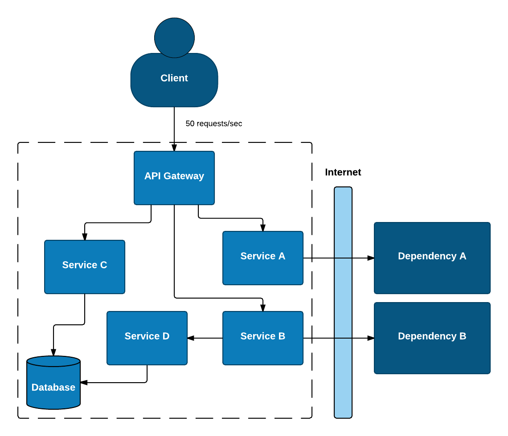
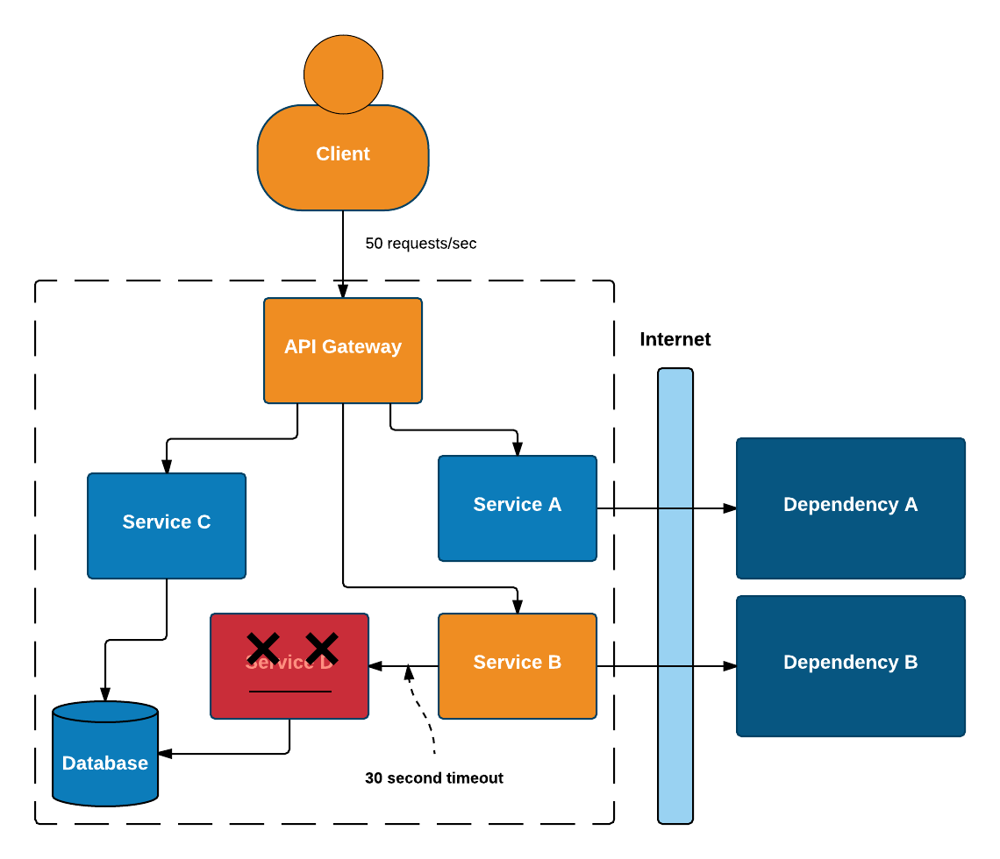
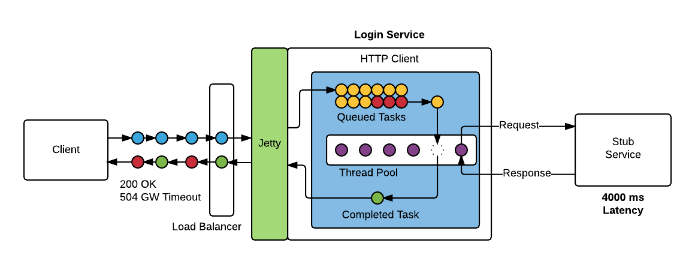

= Embracing failure with Circuit Breaker Hystrix
:revealjs_theme: night
:revealjs_history: true
:revealjs_transition: convex
Jimmi Kristensen (@jimmibk)

== Monolith Application

Splitting up a monolith is difficult

* Defining bounded contexts
* Defining interfaces between new microservices
* Architecture without transactions
* Asynchronous execution
* The list goes on...

[%notitle]
=== My own experience

Many developers (at least the ones I have spoken to) are not experienced in developing highly distributed systems.

Microservices are developed as if it is still a monolith.

Network communication is handled like method calls in the monolith.

This is however very far from reality. Many more moving parts with the added complexity of network is a failure waiting to happen unless handled properly.

[%notitle]
=== Monolith

image::Monolith.png[monolith,700]

[%notitle]
=== Monolith

[%notitle]
=== Monolith

=== What can go wrong?

* Slow Response
** A slow response is worse than no response!
* Blocked Threads
* Cascading Failure

=== Thread Contention

Slow response -> Blocked threads -> Thread contention -> Cascading failure

=== How big should our thread pool be?

Little’s law says that the number of requests in a system equals the rate at which they arrive, multiplied by the average amount of time it takes to service an individual request.

image::queue-cartoon.jpg[queue,700]

=== Little's Law

image::LittlesLaw.png[littleslaw,700]

== Create bulkheads in your software

* Message queues
* Asynchronous communication
* Never trust default timeouts

image::bulkheads.jpg[bulkheads, 500]

== And Circuit Breakers

A simple circuit breaker

=== The Hystrix Circuit Breaker

image::hystrix-command-flow-chart.png[hystrixcb]

=== Circuit Breaker Work Flow

image::circuit-breaker-1280.png[hystflow,750]

=== Hystrix Dashboard

image::dashboard-annoted-circuit-640.png[hystdash]

=== Monitoring a cluster

=== Cluster Example

image::dashboard-example-1280.png[hystclusterexample]

== Demo Application

[%notitle]
=== Sequences

== Great book about Software Stability

image::mnee2.jpg[demoapp,400]

== Resources

* How Hystrix Works: https://github.com/Netflix/Hystrix/wiki/How-it-Works
* Hystrix Prototype Application: https://github.com/jimmikristensen/hystrix-prototype
* FLUG Presentations: https://github.com/FynsLinuxUserGroup/talks
