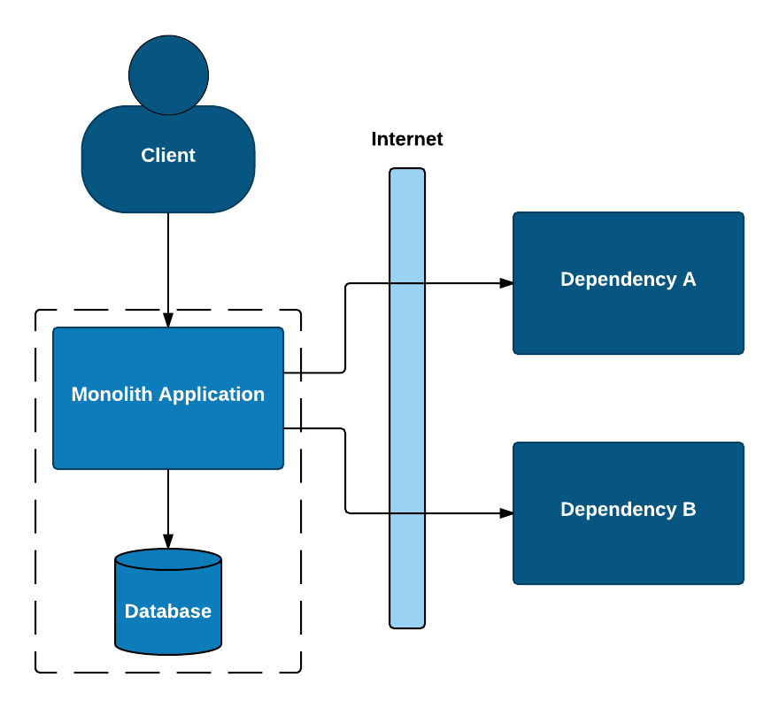

= Embracing failure with Circuit Breaker Hystrix
:revealjs_theme: night
:revealjs_history: true
:revealjs_transition: convex
Jimmi Kristensen - @jimmibk

== Monolith Application

Splitting up a monolith is difficult

* Defining bounded contexts
* Defining interfaces between new microservices
* Architecture without transactions
* Asynchronous execution
* The list goes on...

[%notitle]
=== My own experience

Many developers (at least the ones I have spoken to) are not experienced in developing highly distributed systems.

Microservices are developed as if it is still a monolith.

Network communication is handled like method calls in the monolith.

This is however very far from reality. Many more moving parts with the added complexity of network is a failure waiting to happen unless handled properly.

[%notitle]
=== Monolith

[%notitle]
=== Monolith

image::Microservices.png[microservice,700]

[%notitle]
=== Monolith

image::Dyingmicroservices.png[microservice-dying,700]

=== What can go wrong?

* Slow Response
* Blocked Threads
* Cascading Failure

=== Thread Contention

Slow response -> Blocked threads -> Thread contention -> Cascading failure

image::tread_contention.png[thread]

=== How big should our thread pool be?

Little’s law says that the number of requests in a system equals the rate at which they arrive, multiplied by the average amount of time it takes to service an individual request.

image::queue-cartoon.jpg[queue,700]

=== Little's Law

image::LittlesLaw.png[littleslaw,700]

== Create bulkheads in your software

* Message queues
* Asynchronous communication
* Never trust default timeouts

image::bulkheads.jpg[bulkheads, 500]

== And Circuit Breakers

* Quality Attributes
* Distribueret software, hvad kan gå galt? Release it.
* Normal circuit breaker diagram
** Hystrix CB diagram
* Hystrix dashboard?
* Forklaring på hystrix commands wrapper
** Tråde? Thread contention?
* Diagram over demo app

[%step]
This paragraph is displayed first.

[%step]
Then this paragraph is displayed when the _Next_ arrow is clicked.

== Stepped list items

test

=== Test

[%step]
* A bullet is displayed each time the _Next_ arrow is clicked.
* B
* C

== Stepped blocks

[%step]
--
Block one
--

[%step]
--
Block two
--
